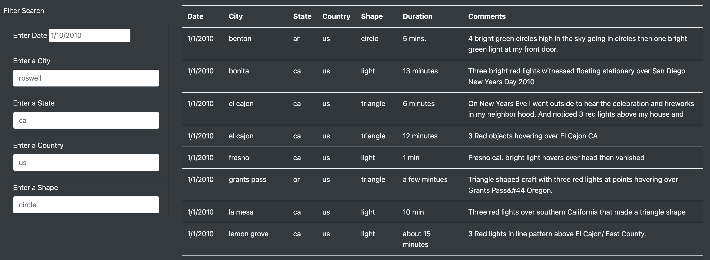
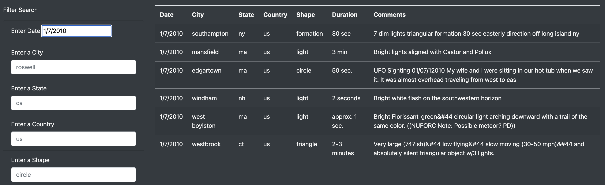
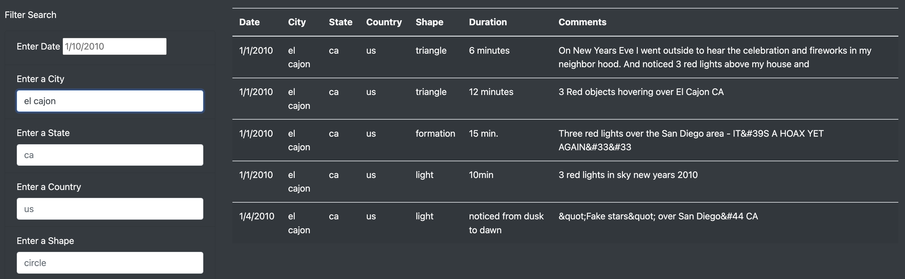
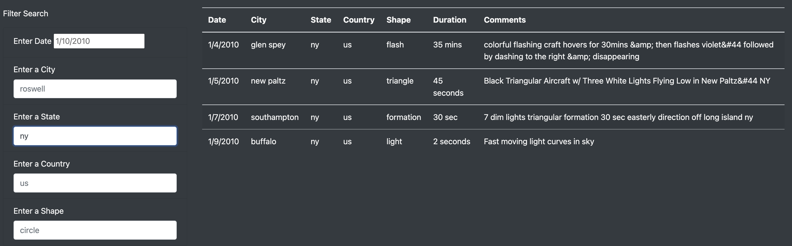
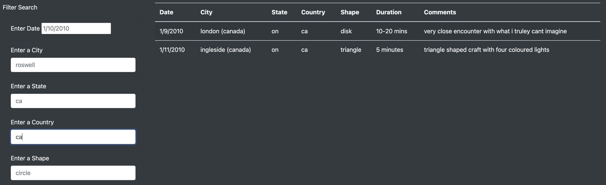
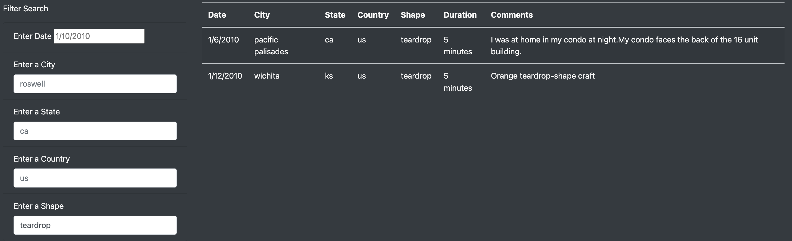
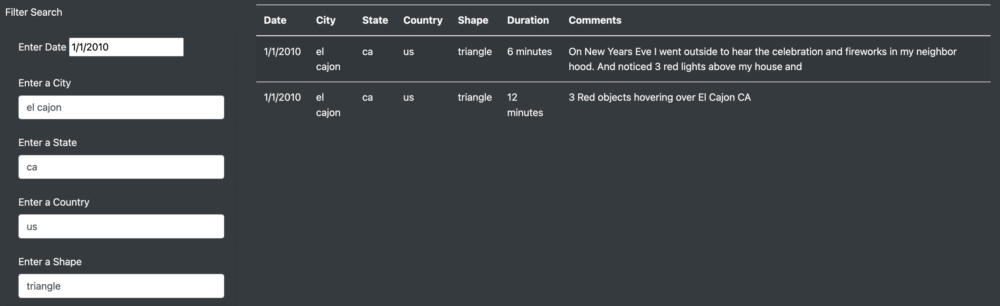

# UFOs

## Overview

In this project, I created a webpage using HTML and JavaScript in order to display a table containing data on UFO sightings. The data contains information of different UFO sighting reports in each row. The features of the reported UFO sightings data include the date, city, state, country, and duration of the sightings, along with a descriptive comment made in the report of each sighting. In addition to displaying the data in a table on the webpage, I made the table dynamic by adding filter functionality. The filters alter the information displayed in the table based on user input seach criteria for five of the different features: date, city, state, country, and shape.

Filtering the table is a rather intuitive and straightforward process. Here, I have included a guide with specific table filtering examples below, for added clarity.

## Results - Table Filtering Walkthrough

### Default View and Placeholders

The default view, when the webpage is first loaded, includes the entire table data to scroll through. On the left of the table are the optional search criteria to filter by. Each search filter includes a form that accepts user input to determine the criteria to search by. The filter is performed by either pressing the 'enter' key, pressing the 'TAB' key to move to the next filter form, or clicking out of the filter form after inputting the filter criteria desired. Greyed-out in each field are example entries as placeholders. The placeholders give examples to suggest how to format the input of the desired search criteria. For instance, 'roswell', the placeholder in the city filter field and well known city among UFO enthusiasts, simply suggests that a city may be entered as such in all lowercase to filter the table data for only UFO sightings in the user-input city. It is important to note that all the non-numeric placeholders are in lowercase. The user must input the criteria in lowercase and in the matching format to the respective placeholder. The filter input is both case-sensitive and returns only exact-matches for the search criteria in the resulting filtered table.

Additional Placeholder Notes:

* The date is formatted as '{numeric month}/{day}/{4-digit year}'. The placeholder is '1/10/2010' for January 10, 2010.
* The state is the standard two letter abbreviation of the state in lowercase. The placeholder is 'ca' for California.
* The country is the standard two letter abbreviation of the country in lowercase. The placeholder is 'us' for United States.
* The shape denotes what shape or form the reported UFO sighting was in. The placeholder is 'circle', for the geometric shape of the object sighted.

The image below shows an example of how the default table will look like upon loading the webpage, along with the placeholders that will appear as well. Expected placeholders by filter; *date : 1/10/2010, city : roswell, state : ca, country : us, shape : circle*.

*The default table and placeholders in each filter field on the left*

### Filtering by Date

To filter the table by date, the user simply inputs the desired date in the first filter form titled, 'Enter date'. Per the placeholder, the format of the entered date must be the one- or two-digit month followed by '/', then the one- or two-digit numbered day of the month followed by another '/', and then lastly the four-digit year. For the date of January 7th, 2010, it is entered like so, '1/7/2010'.

The image below demonstrates an example of the expected outcome when filtering for the date '1/7/2010'.

*The result of filtering the table by the date '1/7/2010'*

### Filtering by City

To filter the table by city, the user inputs the desired city in the second filter form titled, 'Enter a City'. Per the placeholder, the format of the entered city must be the name of the city, typed in all lowercase. To filter the table to view the data for UFO sightings in a city named El Cajon, the user would input 'el cajon' into the filter form corresponding to the city filter.

The image below demonstrates an example of the expected outcome when filtering for the city 'el cajon'.

*The result of filtering the table by the city name 'el cajon'*

### Filtering by State

To filter the table by state, the user inputs the desired state in the third filter form titled, 'Enter a State'. Per the placeholder, the format of the entered state must be the two-letter abbreviation of the state, typed in all lowercase. To filter the table to view the data for UFO sightings in the state of New York, the user would input 'ny' into the filter form corresponding to the state filter.

The image below demonstrates an example of the expected outcome when filtering for the state 'ny' (New York).

*The result of filtering the table by the state 'ny' (New York)*

### Filtering by Country

To filter the table by country, the user inputs the desired country in the fourth filter form titled, 'Enter a Country'. Per the placeholder, the format of the entered country must be the two-letter abbreviation of the country, typed in all lowercase. To filter the table to view the data for UFO sightings in Canada, the user would input 'ca' into the filter form corresponding to the country filter.

The image below demonstrates an example of the expected outcome when filtering for the country 'ca' (Canada).

*The result of filtering the table by the country 'ca' (Canada)*

### Filtering by Shape

To filter the table by shape, the user inputs the desired shape in the fifth filter form titled, 'Enter a Shape'. Per the placeholder, the entered shape must be either a geometric shape, or other form of UFO sighting phenomenon (for example, 'light') that exists within the table data. The shape must also be entered in all lowercase. To filter the table to view the data for UFO sightings, where the described shape is a teardrop, the user would simply input 'teardrop' into the filter form corresponding to the shape filter.

The image below demonstrates an example of the expected outcome when filtering for the shape 'teardrop'.

*The result of filtering the table by the shape 'teardrop'.*

### Combining Filter Search Criteria

To simultaneously filter the table by multiple search criteria, the user inputs the desired combination of filters into each of the respective filter forms. Filtering by multiple criteria can help with efficiently narrowing the user's search for more specific information. For example, if we wanted to find UFO sightings in the shape of a triangle, on new year's day 2010 (1/1/2010) and occuring in El Cajon, California, United States, we would input '1/1/2010' into the date form, 'el cajon' into the city form, 'ca' into the state form, 'us' into the country form, and 'triangle' into the shape form.

The image below demonstrates an example of the expected outcome when filtering for the combination of criteria: date : '1/1/2010', city : 'el cajon', state : 'ca', country : 'us', shape : 'triangle'.

*The result of filtering the table by multiple criteria including the date '1/1/2010', the city 'el cajon', the state 'ca', the country 'us', and the shape 'triangle'.*

## Summary

Upon completion of the *updateFilters()* and *filterTable()* functions in the JavaScript *app.js* code, I successfully implemented the ability to filter the UFO sightings data table by multiple criteria on the constructed webpage. The I have completed this latest objective for the page, there are still evident drawbacks to the method chosen for filtering the table. 

**Drawback**
* When entering search criteria, the user may feel a bit lost when trying to input criteria that returns filter matches. The user may have to scroll through the table to understand what kinds of inputs will result in exact matches to column values. In some cases, this may defeat the purpose of having the ability to filter the table in order to create more efficient access to the UFO sightings data. This can lead to an inefficent use of time and, in result, a more dissatisfying user experience.

**Recommendations**  
1. *Dropdown Filter Selection*:   
To address the aforementioned drawback, we could develop a slighlty different method of inputting filter criteria. Rather than relying on keyboard typed user input, we could implement dropdown menu selections of user input based on existing values in each fitler-corresponding column. This makes the most sense, since the values input must be exact matches to values found in the column. This way the user will not have to scroll through the table to understand what values may be input as filter criteria. This would increase the efficiency of user search time for their required information.

2. *Number of Matches Found*:   
Another useful feature, for further development of the dynamic table filtering tool, would be to display the number of matching table rows returned after the user inputs their filter criteria and the resulting table is returned. For example, the text, '18 Matches Found', could be displayed just underneath the column of filter forms on the left when a user inputs their filter criteria resulting in a filtered table with 18 rows matching the user-input criteria. This would quickly give the user, at a glance, the frequency of UFO sightings matching their criteria within the table data.